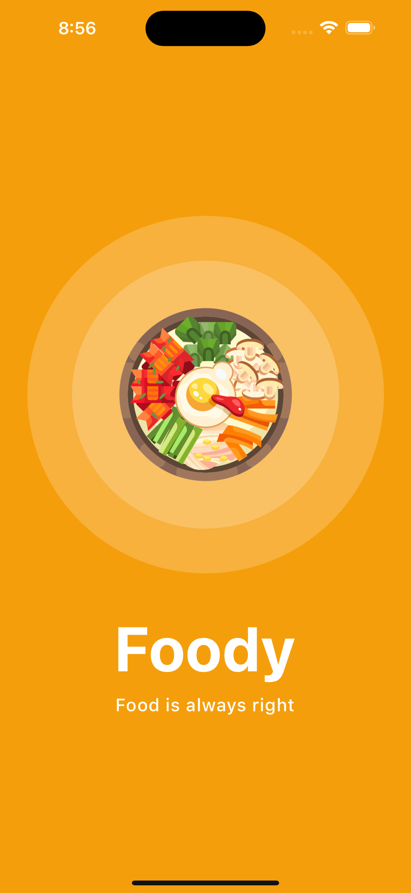
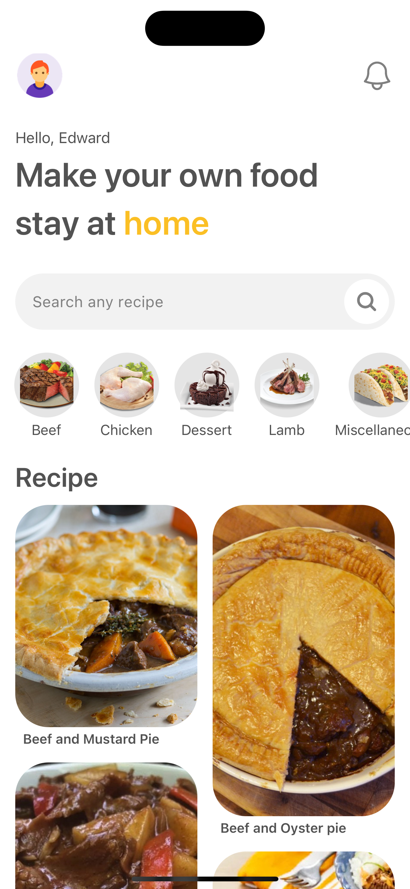
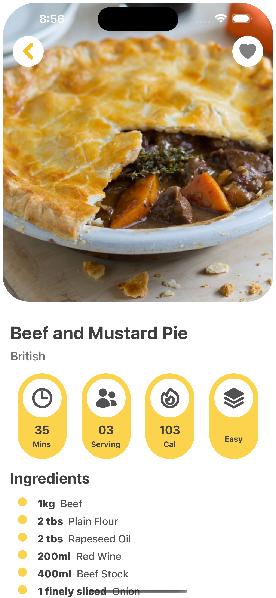

# React Native Food app ui

<table>
  <tr>
    <td valign="top"></td>
    <td valign="top"></td>
    <td valign="top"></td>
  </tr>
</table>
  
  

    Inspried by
    <a href="https://www.youtube.com/channel/UCILovaLl2fUPAww1bGJ4sJQ?sub_confirmation=1">Code With Nomi</a>
  

## Get Started

Node version

### `v16`

install dev dependencies

### `npm install` or `yarn install`

## Then

Run The app

### `npm start` or `yarn start`

 